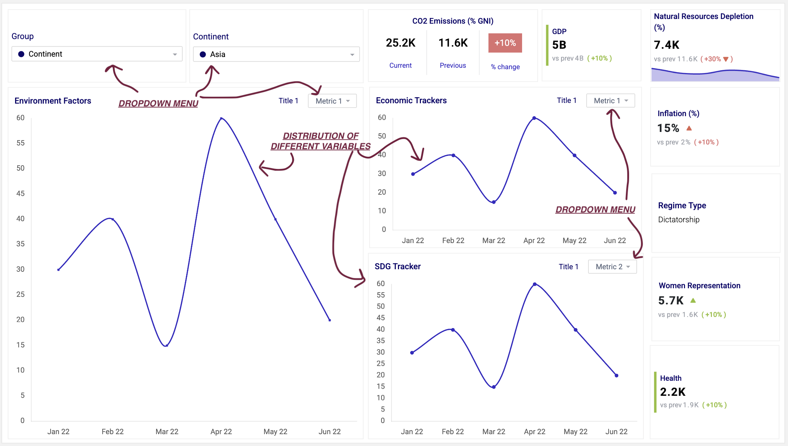
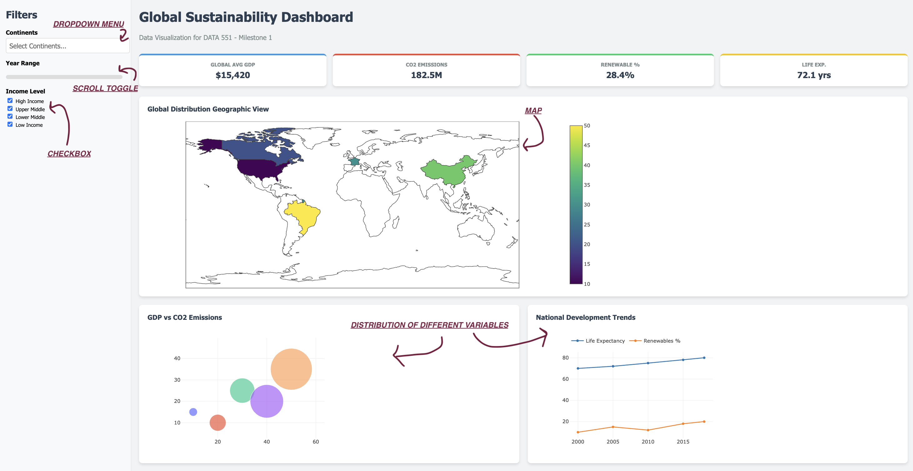

# Global Sustainability Tracker

**[Link to deployed Dash dashboard on Heroku](https://placeholder-url-for-your-app.herokuapp.com/)**

## Motivation and Purpose
The **Global Sustainability Tracker** is an interactive visualization tool designed to help researchers, policy makers, and NGOs explore the "World Sustainability Dataset" (2000–2018). Its primary objective is to highlight the complex trade-offs between a nation's rapid economic expansion and its corresponding environmental and social footprints. By visualizing these three critical dimensions side-by-side, users can critically assess whether a country’s development is truly sustainable or if it comes at the significant cost of natural resource depletion and ecological damage.

### Interface Design
The dashboard's primary view, as sketched below, provides a deep dive into the sustainability metrics of a single country, region, continent, or income group. The interface is organized into a grid layout featuring three main functional areas:

- **Global Filters & Navigation:** Located at the top-left, a dedicated control panel allows users to filter the entire dashboard by **Continent** and **Country/Entity**. This enables seamless switching between broad regional comparisons and deep-dive analyses of specific nations.
- **Key Performance Indicators (KPIs):** The top row features high-level "snapshot" cards for the selected entity, showcasing metrics like CO₂ Emissions, GDP, and Natural Resource Depletion. These cards dynamically include year-over-year percentage changes, color-coded to provide an immediate visual assessment of developmental trajectories.
- **Multi-Dimensional Trend Analysis:** The core of the dashboard consists of three synchronized time-series charts. These allow users to observe correlations across different domains:
    - **Environment Factors:** Tracks ecological damage metrics such as CO₂ damage and forest depletion.
    - **Economic Trackers:** Monitors financial indicators including GDP growth and inflation rates.
    - **SDG Tracker:** Visualizes progress on United Nations Sustainable Development Goals, specifically focusing on health, gender equality, and energy access.

Each chart panel features internal dropdown menus, allowing users to toggle specific variables within that theme to test hypotheses.



### Installation

    - To install the app locally:
      ```bash
      pip install -r requirements.txt
      ```
    - To run the app locally:
      ```bash
      python src/app.py
      ```
      The dashboard will be available at `http://127.0.0.1:8050`.

### Comparative Analysis via Interactive Map
In addition to the deep-dive view, the app provides a comparative mode visualized through an interactive map interface. This feature allows users to select and compare two different countries or regions side-by-side. By leveraging a spatial visualization, users can identify regional clusters of sustainability trends and benchmark the performance of nations. This dual-view approach ensures that both micro-level details and macro-level global patterns are easily accessible to the user.


